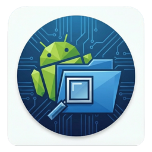

  

# Android System Explorer

**Android System Explorer** is a VS Code extension that allows you to browse, manage, and download files from connected Android devices directly within VS Code. It mimics the "Device File Explorer" feature found in Android Studio, but with the lightweight convenience of VS Code.

## Features

-   **Browse File System**: Navigate the entire Android file system (`/sdcard`, `/data`, etc.).
-   **Smart /data Access**: Automatically handles permission restrictions in `/data` and `/data/data` by listing installed packages and using `run-as` to access debuggable app data.
-   **Download Files**: Right-click to download files to your local machine (`Save As...`).
-   **Open Files**: Directly open files from the device in VS Code (supports text, binary, images, and databases).
-   **Copy Paths**: Quickly copy the remote path of any file or folder.
-   **Root Support**: Easily restart ADB as root (if supported by the device/emulator).

## Requirements

-   **ADB**: The `adb` command must be in your system's PATH.
-   **USB Debugging**: Must be enabled on your Android device.

## Usage

1.  Connect your Android device or start an emulator.
2.  Open the **Android** view in the Activity Bar (mobile icon).
3.  Browse the file tree.
4.  Right-click items for options like **Open**, **Save As**, **Copy Path**, and **Synchronize**.

## Known Issues

-   Accessing `/data` works best on emulators or rooted devices.
-   For non-rooted devices, you can access `/data/data/<your-package>` only if your app is **debuggable**.

## License

MIT
